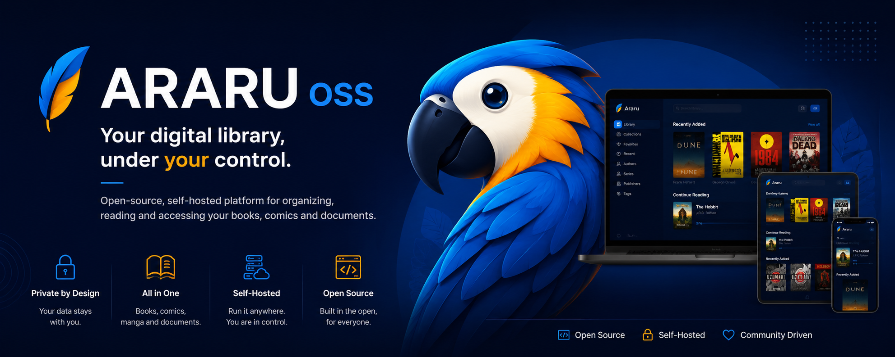

<p align="center">
  
</p>
<p align="center">
  <strong>Your digital collection, under your control.</strong>
</p>

<p align="center">
  Open source · Self-hosted · Privacy by design · Made in Brazil 🇧🇷
</p>

<p align="center">
  <a href="https://github.com/Araru-OSS/araru">Explore the project</a>
  ·
  <a href="https://github.com/Araru-OSS/araru/tree/main/docs">Documentation</a>
  ·
  <a href="https://github.com/Araru-OSS/araru/blob/main/CONTRIBUTING.md">Contribute</a>
</p>

<p align="center">
  
  
  
  
</p>

---

## 📚 What is Araru?

**Araru** is an open-source, self-hosted digital library server for organizing, searching, preserving, and reading your own collection.

You keep control of your files, metadata, reading history, and infrastructure — with a responsive web experience for desktop, tablet, and mobile.

> **Your library. Your server. Your data.**

### Built for real collections

- 📖 Books and ebooks
- 💬 Comics and manga
- 📰 Magazines
- 📄 Documents

## ✨ Current features

- Local catalog with optional Google Drive integration
- Folder-based hierarchical categories
- Full-text search, filters, favorites, and series
- Metadata, covers, review tools, and duplicate detection
- Reading progress, continue where you left off, and statistics
- Built-in readers for **PDF, EPUB, MOBI, CBZ, and CBR**
- PWA support and explicit offline downloads
- Backups, integrity checks, and operational jobs
- Architecture ready for multiple clients

## 🧩 How it works

Araru separates the server — responsible for the library and its data — from the clients that provide the user experience:

```text
                         ┌────────────────────┐
                         │    Araru Server    │
                         │ API · Auth · Data  │
                         │ Storage · Metadata │
                         └──────────┬─────────┘
                                    │ HTTP
                         ┌──────────▼─────────┐
                         │      Araru Web     │
                         │    React · Vite    │
                         │        PWA         │
                         └────────────────────┘
```

The server communicates with PostgreSQL, Redis, the filesystem/cache, and optional storage providers. Clients never access the database or storage directly.

## 🛠️ Stack

`Node.js` · `Express` · `React` · `Vite` · `PWA` · `PostgreSQL` · `Redis` · `Docker`

## 🚧 Project status

Araru is in **active development**. The current foundation includes the server and web client; APIs, features, and architecture may continue to evolve before the first stable release.

Upcoming directions include mobile and desktop clients, audiobooks, a versioned API, expanded multi-user support, and continued evolution of the storage layer. See the [roadmap](https://github.com/Araru-OSS/araru/tree/main/docs/roadmap) to follow what is being considered.

## 🏷️ Versioning and releases

Each distributable component follows [Semantic Versioning](https://semver.org/) with an independent release cycle. Araru Server, Web, and Docs therefore do not need matching version numbers. Releases are derived from Conventional Commits and published through automated release pull requests.

- `fix:` produces a patch release;
- `feat:` produces a minor release;
- `!` or `BREAKING CHANGE:` produces a major release.

Runtime deployments should pin exact Server and Web versions. Every product repository uses `0.1.0` as its initial baseline, including the reserved Android and Desktop clients.

## 🤝 Built in public

Contributions are welcome — code, testing, documentation, accessibility, UX, translations, and good ideas. Before opening an issue or pull request, please read the [contribution guidelines](https://github.com/Araru-OSS/araru/blob/main/CONTRIBUTING.md).

If you discover a security vulnerability, follow the project's private reporting instructions instead of opening a public issue.

## 🔗 Links

- [Araru repository](https://github.com/Araru-OSS/araru)
- [Technical documentation](https://github.com/Araru-OSS/araru/tree/main/docs)
- [Architecture](https://github.com/Araru-OSS/araru/blob/main/docs/architecture/overview.md)
- [Getting started guide](https://github.com/Araru-OSS/araru/tree/main/docs/getting-started)
- [Roadmap](https://github.com/Araru-OSS/araru/tree/main/docs/roadmap)
- [Araru OSS organization](https://github.com/Araru-OSS)

<p align="center">
  <br>
  
  <br><br>
  <em>Read. Organize. Preserve.</em>
</p>
